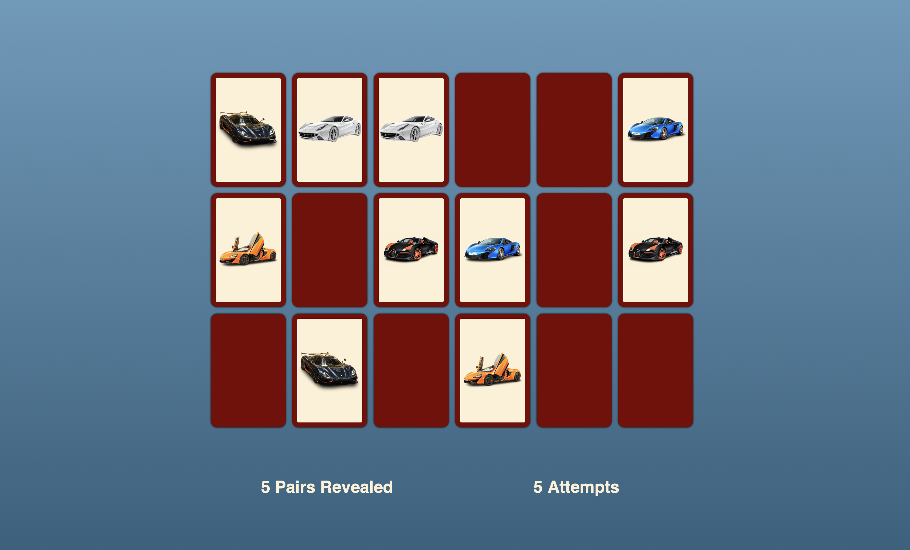

## Memory Game Project

This project is a memory game created using HTML, CSS, and JavaScript. The objective of the game is to match pairs of tiles by flipping them over. The game board consists of a 6x3 grid, making a total of 18 tiles. Each tile has an image of a car, and there are nine unique images, each appearing twice on the board. Players click on tiles to reveal the images underneath and try to find matching pairs. When a match is found, the tiles remain revealed. The game continues until all pairs are matched.

### How the Game Works

1. **Game Initialization**: 
   - The game starts by generating a grid of tiles. Each tile is created dynamically using JavaScript and assigned an image.
   - The images are shuffled and paired, ensuring that each image appears exactly twice.

2. **Tile Flipping Mechanism**:
   - When a player clicks on a tile, it flips over to reveal the image.
   - If it is the first tile of a pair, it becomes the active tile.
   - If it is the second tile of a pair, the game checks if it matches the active tile.

3. **Matching Logic**:
   - If the images of the two selected tiles match, both tiles remain revealed.
   - If the images do not match, both tiles flip back over after a short delay.

4. **Score Keeping**:
   - The game keeps track of the number of pairs revealed.
   - The score is updated and displayed on the screen.

5. **Winning Condition**:
   - The game ends when all pairs are matched.

This project was inspired by [dcode's YouTube tutorial](https://youtu.be/bznJPt4t_4s). I have commented on every line of code that I haven't learned to use for this project, showing my understanding of the utilized code.
